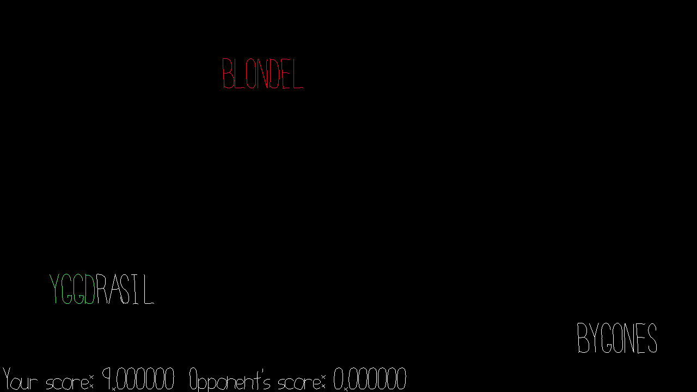

# FasterFingers

Author: pbhuang

Design: You know those games you played as a child when you learned how to type? Or those games on Quizlet where you have to type the words as they scroll by. This is the multiplayer version of that! See who can type more words in 30 seconds (customizable in [Gamel.hpp](Gamel.hpp)). Your score for each word is how many characters were in the word.

However, there is a twist! If a player gets halfway across your screen, the opponent now has a chance to steal the word from you if they type it first! Then, they will score 1.5x the number of characters while you score none! So make sure you type fast! 

Opponent words are in red, your words are in white. Typed characters show up in green.

Lots of game parameters are customizable in [Gamel.hpp](Gamel.hpp). Feel free to tweak to have fun!

Networking: Multiplayer implemented in Game.cpp/Game.hpp. I used the same basic framework that was used in the base code but the 
main difference was the content I was transmitting. C2S, I transmitted words that were fully typed out by a player, and words that could now be
displayed as opponent words to the opponent. S2C, I transmitted new words the player could type (generated from the server), new words from the opponent that a player could type and steal points, and whether or not words should be deleted off the screen (because the other player typed them first). Finally for both C2S and S2C, I continuously updated each player with the other player's score information. I had one additional message type which basically transmitted when the game was over.

How To Play:

Once two players connect to the server, the game starts.
Just type out words that are on the screen.

Sources: All assets already came with the game.

This game was built with [NEST](NEST.md).

